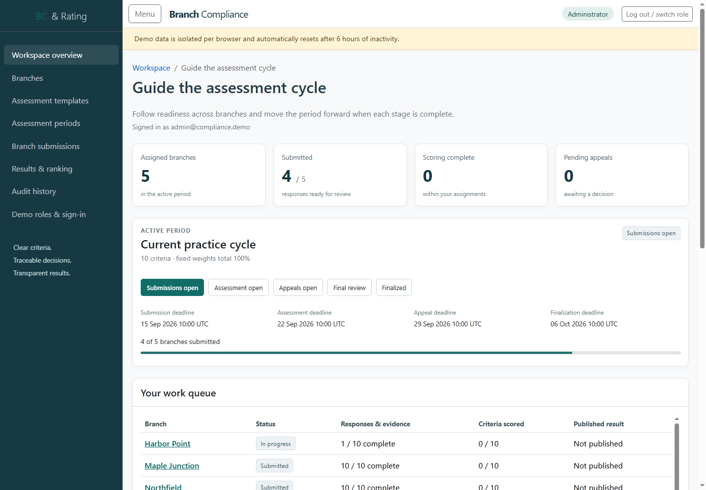
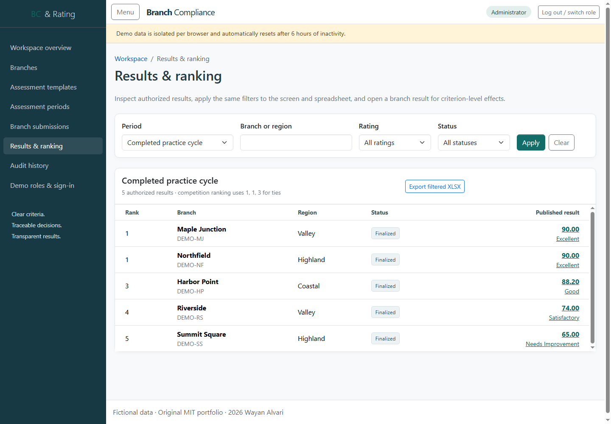
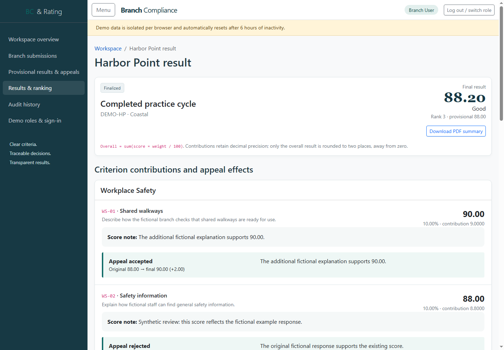
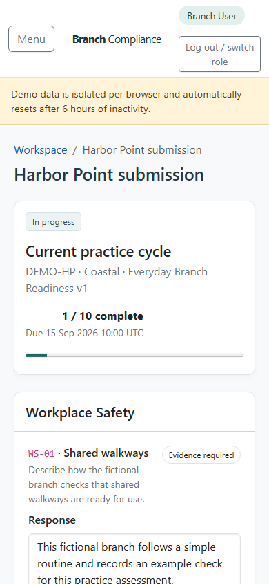

# Branch Compliance & Rating

An original portfolio application for running a transparent branch assessment
cycle. An Administrator publishes versioned criteria and opens a period, a
Branch User submits responses and protected evidence, an Assessor scores each
criterion, and an Approver resolves appeals before the final rating and ranking.



This independent portfolio project was built from scratch using generic
branch-compliance and assessment concepts. It contains no employer source code,
confidential data, proprietary scoring model, branding, or copied business
assets.

This is a fictional demonstration, not a regulatory engine or certification
product. Original code is MIT licensed, Copyright (c) 2026 Wayan Alvari.

## What the application demonstrates

- Four server-enforced roles with assignment and record-level authorization.
- Browser-isolated demo workspaces that reset after six inactive hours.
- Draft and immutable published templates with exact 100.00% weight validation.
- Period-owned criterion and rating-band snapshots that preserve history.
- Protected PDF, JPEG, and PNG evidence outside public static content.
- Decimal weighted scoring, provisional publication, criterion appeals, and
  immutable score revisions.
- Final ratings, competition ranking with ties, filter-matched XLSX export,
  branch PDF summaries, and role-scoped audit history.
- Responsive AdminLTE pages, keyboard focus, semantic landmarks, text status
  labels, table captions, validation summaries, and safe confirmation prompts.

## Run the local demo

Install these exact prerequisites:

- .NET SDK 8.0.424
- Node.js 22 and npm 10
- PowerShell 7 or Windows PowerShell 5.1

From the repository root:

```powershell
dotnet tool restore
dotnet restore --locked-mode
npm ci
dotnet build -c Release --no-restore
./scripts/Start-Demo.ps1 -Sqlite
```

Open `http://localhost:5094`. The final command explicitly enables Development,
demo workspaces, and an ignored local SQLite database. SQLite cannot start in
Production, and production startup never applies migrations or seeds identities.

If SDK 8.0.424 is extracted to `.local/dotnet`, dot-source
`./scripts/Use-LocalSdk.ps1` before the other `dotnet` commands. The helper keeps
SDK and NuGet caches in ignored repository directories.

## Demo accounts

All accounts use password `PortfolioDemo123!`.

| Role | Email | Main responsibility |
|---|---|---|
| Administrator | `admin@compliance.demo` | Branches, templates, periods, publication |
| Branch User | `branch@compliance.demo` | Harbor Point responses, evidence, appeals |
| Assessor | `assessor@compliance.demo` | Assigned criterion scoring |
| Approver | `approver@compliance.demo` | Appeal decisions and finalization |

Log out before switching roles in the same browser so the workflow remains in
one workspace. A private window receives a different workspace and cannot open
IDs or evidence copied from the first browser.

## Suggested review path

1. Sign in as Administrator and inspect the published ten-criterion template,
   the active snapshotted period, fictional branches, and workflow readiness.
2. Switch to Branch User. Open Harbor Point, save the incomplete response, and
   inspect the protected evidence controls. The historical result shows both an
   accepted and a rejected appeal.
3. Switch to Assessor and inspect the assigned scoring queue, criterion notes,
   decimal contributions, and completion guard.
4. Switch to Approver and review the appeal comparison and finalization rules.
5. Open Results & ranking. Confirm the 90.00 tie uses ranks 1, 1, 3, filter the
   table, export XLSX, open Harbor Point, and download its PDF summary.
6. Open Audit history under each role to see that sensitive or unrelated events
   remain outside that role's scope.



## Scoring and ranking

Each criterion contribution is:

```text
criterion score * (criterion weight / 100)
```

All arithmetic uses `decimal`. Contributions retain their precision and only
the summed result is rounded to two places, with midpoints away from zero. The
fictional rating thresholds are Excellent 90, Good 80, Satisfactory 70, and
Needs Improvement 0. Equal final scores share competition rank, so two first
places are followed by third place. Branch name orders rows within a tie.



## Solution structure

| Project | Responsibility |
|---|---|
| `BranchCompliance.Domain` | Aggregates, state transitions, scoring rules, immutable history |
| `BranchCompliance.Application` | Use cases, authorization, workspace and storage contracts |
| `BranchCompliance.Infrastructure` | EF Core, Identity, MySQL/SQLite, files, cleanup, XLSX/PDF |
| `BranchCompliance.Web` | MVC controllers, Razor views, middleware, browser policies |
| `BranchCompliance.UnitTests` | Domain boundary and arithmetic tests |
| `BranchCompliance.IntegrationTests` | Relational persistence, HTTP, roles, isolation, files, exports |

The application is a single-process modular monolith. Every domain row carries a
workspace ID; EF query filters, composite foreign keys, write guards, and use-case
authorization enforce isolation together. See [architecture decisions](Docs/ARCHITECTURE.md).

## Verification

Run the complete gate from [the testing guide](Docs/TESTING.md):

```powershell
dotnet tool restore
dotnet restore --locked-mode
npm ci
npm audit --omit=dev
dotnet format --verify-no-changes
dotnet build -c Release --no-restore
dotnet test -c Release --no-build
dotnet list package --vulnerable --include-transitive
dotnet list package --deprecated
```

The handoff baseline passes 29 unit and 65 integration tests with zero build
warnings, zero npm vulnerabilities, and zero NuGet vulnerabilities. Chrome 152
also completed all four logins, XLSX/PDF downloads, and a 390 px mobile pass with
no console errors or horizontal overflow. The dependency audit identifies only
test-only xUnit 2.9.3 as legacy; the tested v2 line is retained to avoid an
unreviewed major-version migration.



## Database and publishing

MySQL Community Server 8.0.46 is the deployment database. The normal suite and
local demo require no database secret. [Database setup](Docs/DATABASE.md) covers
separate least-privilege application and migration users, reviewed migrations,
and the optional configured-MySQL workflow. No MySQL credential was available in
the implementation environment, so a live MySQL migration is not claimed.

[Manual operations](Docs/OPERATIONS.md) documents framework-dependent and
self-contained Release publishing, external configuration, persistent Data
Protection keys, evidence storage, local reverse-proxy forwarding, health,
backups, restart, and rollback. Hosting and remote push remain owner actions.

## Security and operating limits

Identity cookies are HTTP-only and secure outside Development. Dynamic responses
are private/no-store and carry a restrictive content security policy plus frame,
content-type, referrer, permissions, and cross-origin controls. Uploads have
request, count, extension, media-type, magic-byte, length, name, and SHA-256
checks. Expected failures use structured logs without supplied response text.

Run one application process for this portfolio demo. Shared data-protection keys
are supported, but distributed workspace coordination and shared evidence
storage are outside this implementation. Upgrade and revalidate the application
on .NET 10 before keeping a public deployment online past .NET 8 end of support
on 10 November 2026.

## License and provenance

Original repository code is licensed under [MIT](LICENSE). Dependency licenses
and versions are in [third-party notices](THIRD-PARTY-NOTICES.md). The
[clean-room declaration](CLEAN-ROOM-DECLARATION.md) records the project's
independent, fictional provenance.
